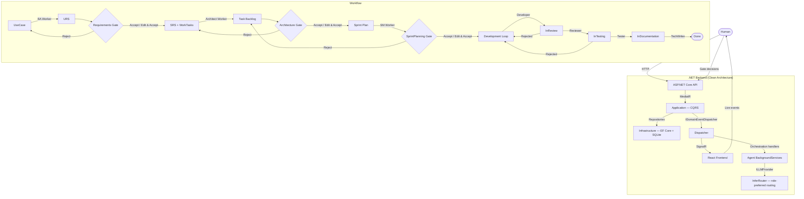

# ChaosForge

A multi-agent AI software development team simulator built in .NET 10. A human defines a project with Use Cases; seven AI agents (BA, Architect, Scrum Master, Developer, Tester, Reviewer, Technical Writer) execute a full Scrum-like workflow autonomously, with the human acting as judge at three mandatory revision gates.

---

## Why This Exists

Most agent frameworks treat the LLM as a single actor or a flat network of peers. ChaosForge models a structured team with defined roles, a sequential workflow, and explicit human checkpoints — closer to how software is actually built. The name refers to the butterfly effect: a single human edit at a revision gate propagates downstream and can cascade into entirely different specifications, tasks, and sprint plans.

---

## Architecture Overview



---

## Key Design Decisions

- **Clean Architecture with a zero-dependency Domain layer.** Domain has no NuGet references. All external interfaces (`ILLMProvider`, `IProjectRepository`, `IDomainEventDispatcher`) are declared in Domain or Application and implemented in Infrastructure. Layer violations are detectable by project reference analysis alone. → [ADR-001](docs/adr/001-clean-architecture.md)

- **ILLMProvider abstraction decouples agents from LLM backends.** Application handlers call `ILLMProvider` via constructor injection and never reference LlamaSharp, Groq, or any SDK namespace. Role-to-provider mapping is resolved once in `AddInfrastructureServices()`. Adding a new provider requires no changes outside Infrastructure. → [ADR-004](docs/adr/004-illmprovider-abstraction.md)

- **RevisionGate is a first-class domain entity, not a flag.** It stores the original agent output, the human-edited version, the decision, and the rejection reason — enabling full audit trails and clean retry cycles. `EditAndAccept` raises a domain event consumed by `ButterflyService`, which propagates changes downstream without special-casing in callers. → [ADR-005](docs/adr/005-revision-gate-entity.md)

- **TaskAttempt per dev/review/test cycle enables prompt-level learning from rejection.** Every cycle creates an immutable `TaskAttempt`. When a new cycle starts on a rejected task, the previous attempt's output and rejection note are injected into the prompt — agents receive context without maintaining in-memory state. → [ADR-006](docs/adr/006-task-attempt-per-cycle.md)

- **LlamaSharp over Ollama for local inference.** LlamaSharp runs llama.cpp in-process via P/Invoke — no external daemon, no HTTP overhead, no Docker container. `dotnet run` is sufficient to start the entire system including local LLM inference. → [ADR-007](docs/adr/007-llamasharp-vs-ollama.md)

- **Agent workers are BackgroundServices with no transport awareness.** Workers dispatch MediatR commands and emit domain events only. SignalR is wired via `IDomainEventDispatcher` in Infrastructure — swapping the real-time transport requires a single new implementation, no changes to agents. → [ADR-003](docs/adr/003-background-service-workers.md), [ADR-009](docs/adr/009-signalr-events.md)

---

## Domain Model

| Concept | Description |
|---|---|
| **UseCase** | Unit of work defined by the human. Entry point for the entire pipeline. |
| **URS** | User Requirements Specification — BA agent output from a UseCase. |
| **SRS** | Software Requirements Specification — Architect agent output from a URS. |
| **WorkTask** | Atomic development unit derived from an SRS. Executed by Developer agents. |
| **TaskAttempt** | Immutable record of one dev/review/test cycle. Full audit trail; input to next cycle. |
| **RevisionGate** | Human checkpoint (Requirements / Architecture / SprintPlanning). Stores agent output, human edit, decision, and rejection reason. |
| **AgentSlot** | Project-level config: which roles are active and how many instances. |
| **AgentInstance** | A running agent with identity and lifecycle (Idle / Working / Blocked / Finished). |

**Project state machine:** `Setup → RequirementsPhase → ArchitecturePhase → SprintPlanning → Development → Completed`

**WorkTask state machine:** `Backlog → InProgress → InReview → InTesting → InDocumentation → Done` (Reviewer/Tester rejection returns to Backlog with notes)

---

## Agent Roles

| Role | Cardinality | Phase | Input → Output |
|---|---|---|---|
| Business Analyst | 1 (singleton) | RequirementsPhase | UseCases → URS |
| Architect | 1 (singleton) | ArchitecturePhase | URS → SRS + WorkTasks |
| Scrum Master | 1 (singleton) | SprintPlanning | Backlog → Sprint plan |
| Developer | 1..N | Development | Task → implementation |
| Tester | 1..N | Development | Code → test cases |
| Reviewer | 1..N | Development | Code → accept / reject |
| Technical Writer | 1..N | Development | Code → documentation |

Singleton constraints (BA, Architect, Scrum Master) are enforced at the domain level.

---

## LLM Provider Strategy

```
ILLMProvider
└── InferRouterLlmProvider — calls InferRouter's /v1/chat/completions,
                             two keyed instances differ only by preferred_provider_name
```

| Roles | Keyed provider | Preferred provider name | Rationale |
|---|---|---|---|
| BA, Architect, Scrum Master | `cloud-preferred` | `groq` | Deep reasoning, structured output — latency acceptable |
| Developer, Tester, Reviewer, Technical Writer | `local-preferred` | `local-llama` | Repetitive cycles, CPU-feasible, offline-capable |

---

## Tech Stack

- **Backend:** .NET 10, ASP.NET Core Web API
- **Frontend:** React, Vite, TypeScript
- **Real-time:** ASP.NET Core SignalR
- **ORM/DB:** EF Core + SQLite — zero external infrastructure
- **LLM routing:** InferRouter (companion service) — OpenAI-compatible `/v1/chat/completions`, multi-provider fallback
- **CQRS dispatch:** MediatR with FluentValidation pipeline behaviors
- **Testing:** xUnit, FluentAssertions, NSubstitute

---

## Project Status

**Backend: complete.** All 31 feature specs implemented and merged (as of 2026-04-12):
- Domain entities, events, and repository interfaces
- Full CQRS command/query layer (MediatR + FluentValidation)
- EF Core + SQLite persistence with migrations
- Groq and LlamaSharp LLM providers
- All seven agent workers as BackgroundServices
- Phase orchestration and development loop handlers
- ButterflyService (EditAndAccept downstream propagation)
- SignalR hub with domain event notification handlers

**Next milestone:** React frontend — Sprint Board, Revision Gate panel, live agent monitor.

---

## Getting Started

**Prerequisites:** .NET 10 SDK, Node.js 20+, an InferRouter instance running and reachable on the local network.

```bash
git clone https://github.com/vvidman/ChaosForge.git
cd ChaosForge
```

```bash
cp src/ChaosForge.API/appsettings.Development.example.json \
   src/ChaosForge.API/appsettings.Development.json
```

Edit the file:

```json
{
  "InferRouter": { "BaseUrl": "http://<your-inferrouter-host>:5100" }
}
```

```bash
dotnet ef database update --project src/ChaosForge.Infrastructure \
                          --startup-project src/ChaosForge.API

dotnet run --project src/ChaosForge.API
```

API available at `https://localhost:5001`.

---

## Contributing

- Follow Clean Architecture boundaries strictly: no domain logic in Infrastructure, no EF Core in Application.
- Every public type in Domain and Application must be covered by unit tests.
- PRs must be focused — one concern per pull request. Open an issue before submitting anything non-trivial.

**Commit style** — [Conventional Commits](https://www.conventionalcommits.org/):

```
feat(domain): add TaskAttempt retry count cap
fix(infra): handle Groq rate limit with exponential backoff
```

**PR checklist:**
- [ ] `dotnet test` passes
- [ ] New behavior covered by tests
- [ ] No new compiler warnings
- [ ] `appsettings.Development.example.json` updated if new config keys added

---

## License

Apache License 2.0 — see [LICENSE](LICENSE) for details.
