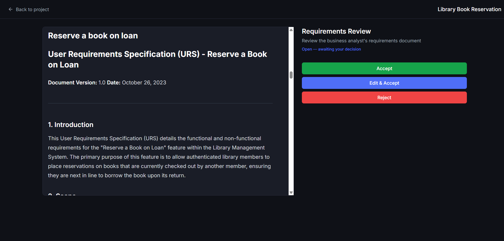
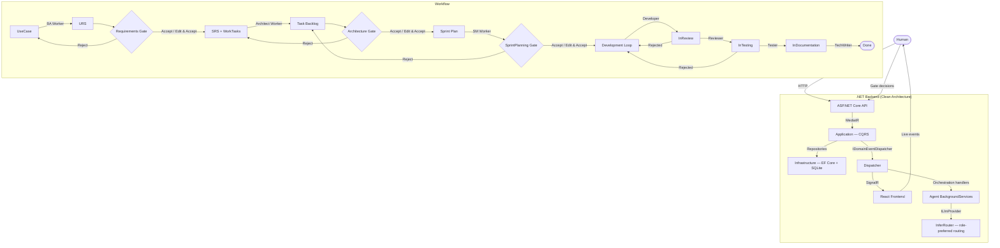
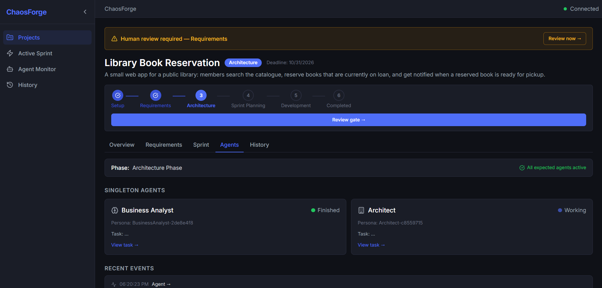
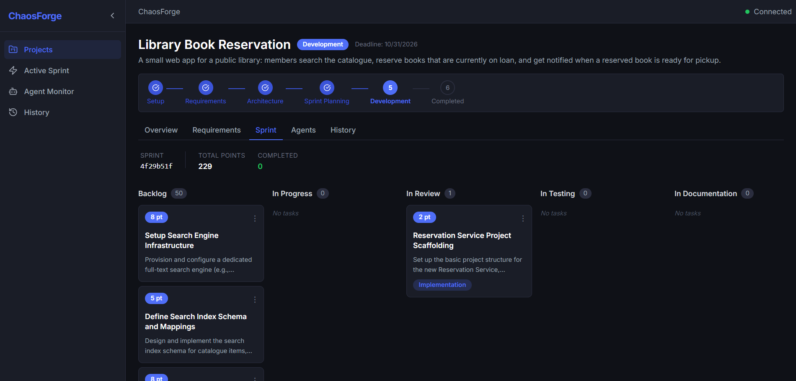
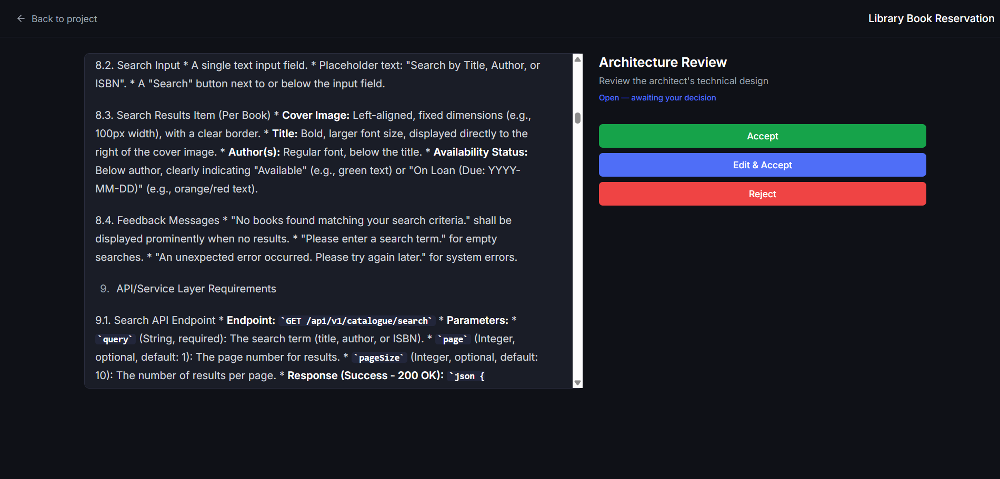

# ChaosForge

[](https://github.com/vvidman/ChaosForge/actions/workflows/ci.yml)
[](LICENSE)

A multi-agent AI software development team simulator built in .NET 10. A human defines a project with Use Cases; seven AI agents (BA, Architect, Scrum Master, Developer, Tester, Reviewer, Technical Writer) execute a full Scrum-like workflow autonomously, with the human acting as judge at three mandatory revision gates.



---

## Why This Exists

Most agent frameworks treat the LLM as a single actor or a flat network of peers. ChaosForge models a structured team with defined roles, a sequential workflow, and explicit human checkpoints — closer to how software is actually built. The name refers to the butterfly effect: a single human edit at a revision gate propagates downstream and can cascade into entirely different specifications, tasks, and sprint plans.

---

## Architecture Overview


```mermaid
flowchart TD
    Human([Human])

    subgraph Workflow
        UC[UseCase] -->|BA Worker| URS[URS]
        URS --> RG1{Requirements Gate}
        RG1 -->|Accept / Edit & Accept| SRS
        RG1 -->|Reject| UC

        SRS[SRS + WorkTasks] -->|Architect Worker| WTs[Task Backlog]
        WTs --> RG2{Architecture Gate}
        RG2 -->|Accept / Edit & Accept| Sprint
        RG2 -->|Reject| SRS

        Sprint[Sprint Plan] -->|SM Worker| RG3{SprintPlanning Gate}
        RG3 -->|Accept / Edit & Accept| Dev
        RG3 -->|Reject| WTs

        Dev[Development Loop] -->|Developer| Review[InReview]
        Review -->|Reviewer| Test[InTesting]
        Test -->|Tester| Docs[InDocumentation]
        Docs -->|TechWriter| Done([Done])
        Review -->|Rejected| Dev
        Test -->|Rejected| Dev
    end

    subgraph Backend[".NET Backend (Clean Architecture)"]
        API[ASP.NET Core API] -->|MediatR| App[Application — CQRS]
        App -->|Repositories| Infra[Infrastructure — EF Core + SQLite]
        App -->|IDomainEventDispatcher| Dispatcher
        Dispatcher -->|SignalR| React[React Frontend]
        Dispatcher -->|Orchestration handlers| Workers[Agent BackgroundServices]
        Workers -->|ILlmProvider| InferRouter[InferRouter — role-preferred routing]
    end

    Human -->|HTTP| API
    Human -->|Gate decisions| API
    React -->|Live events| Human
```

---

## Screenshots

**Agent Monitor.** Phase-scoped agents are activated from the project's agent slots. Here the Business Analyst has finished and the Architect is working on the SRS.



**Sprint Board.** After the Sprint Planning gate, Developer, Reviewer, Tester and Technical Writer agents pull tasks through the board in parallel.



**Architecture gate.** Every phase ends at a human checkpoint; the Architect's SRS is reviewed before the Scrum Master plans the sprint.



---

## Key Design Decisions

- **Clean Architecture with a zero-dependency Domain layer.** Domain has no NuGet references. All external interfaces (`ILlmProvider`, `IProjectRepository`, `IDomainEventDispatcher`) are declared in Domain or Application and implemented in Infrastructure. Layer violations are detectable by project reference analysis alone. → [ADR-001](docs/adr/001-clean-architecture.md)

- **ILlmProvider abstraction decouples agents from LLM backends.** Application handlers call `ILlmProvider` via constructor injection and never reference a provider SDK. Role-to-provider mapping is resolved once in `AddInfrastructure()`. The abstraction made the later move from in-process providers to InferRouter an Infrastructure-only change. → [ADR-004](docs/adr/004-illmprovider-abstraction.md), [ADR-011](docs/adr/011-inferrouter-integration.md)

- **RevisionGate is a first-class domain entity, not a flag.** It stores the original agent output, the human-edited version, the decision, and the rejection reason — enabling full audit trails and clean retry cycles. `EditAndAccept` raises a domain event consumed by `ButterflyService`, which propagates changes downstream without special-casing in callers. → [ADR-005](docs/adr/005-revision-gate-entity.md)

- **TaskAttempt per dev/review/test cycle enables prompt-level learning from rejection.** Every cycle creates an immutable `TaskAttempt`. When a new cycle starts on a rejected task, the previous attempt's output and rejection note are injected into the prompt — agents receive context without maintaining in-memory state. → [ADR-006](docs/adr/006-task-attempt-per-cycle.md)

- **LLM routing is delegated to InferRouter.** The first version ran LlamaSharp in-process next to a direct Groq client ([ADR-007](docs/adr/007-llamasharp-vs-ollama.md), now superseded). Once the companion router [InferRouter](https://github.com/vvidman/InferRouter) existed, keeping its own provider integrations duplicated what InferRouter already owns: provider fallback, rate-limit tracking and health checks. ChaosForge now sends every call through InferRouter and only states a *preferred* provider per role, which keeps the role-based routing and adds a shared fallback chain. → [ADR-011](docs/adr/011-inferrouter-integration.md)

- **Agent workers are BackgroundServices with no transport awareness.** Workers dispatch MediatR commands and emit domain events only. SignalR is wired via `IDomainEventDispatcher` in Infrastructure — swapping the real-time transport requires a single new implementation, no changes to agents. → [ADR-003](docs/adr/003-background-service-workers.md), [ADR-009](docs/adr/009-signalr-events.md)

---

## Domain Model

| Concept | Description |
|---|---|
| **UseCase** | Unit of work defined by the human. Entry point for the entire pipeline. |
| **URS** | User Requirements Specification — BA agent output from a UseCase. |
| **SRS** | Software Requirements Specification — Architect agent output from a URS. |
| **WorkTask** | Atomic development unit derived from an SRS. Executed by Developer agents. |
| **TaskAttempt** | Immutable record of one dev/review/test cycle. Full audit trail; input to next cycle. |
| **RevisionGate** | Human checkpoint (Requirements / Architecture / SprintPlanning). Stores agent output, human edit, decision, and rejection reason. |
| **AgentSlot** | Project-level config: which roles are active and how many instances. |
| **AgentInstance** | A running agent with identity and lifecycle (Idle / Working / Blocked / Finished). |

**Project state machine:** `Setup → RequirementsPhase → ArchitecturePhase → SprintPlanning → Development → Completed`

**WorkTask state machine:** `Backlog → InProgress → InReview → InTesting → InDocumentation → Done` (Reviewer/Tester rejection returns to Backlog with notes)

---

## Agent Roles

| Role | Cardinality | Phase | Input → Output |
|---|---|---|---|
| Business Analyst | 1 (singleton) | RequirementsPhase | UseCases → URS |
| Architect | 1 (singleton) | ArchitecturePhase | URS → SRS + WorkTasks |
| Scrum Master | 1 (singleton) | SprintPlanning | Backlog → Sprint plan |
| Developer | 1..N | Development | Task → implementation |
| Tester | 1..N | Development | Code → test cases |
| Reviewer | 1..N | Development | Code → accept / reject |
| Technical Writer | 1..N | Development | Code → documentation |

Singleton constraints (BA, Architect, Scrum Master) are enforced at the domain level.

---

## LLM Provider Strategy

```
ILlmProvider
└── InferRouterLlmProvider — calls InferRouter's /v1/chat/completions,
                             two keyed instances differ only by preferred_provider_name
```

| Roles | Keyed provider | Preferred provider name | Rationale |
|---|---|---|---|
| BA, Architect, Scrum Master | `cloud-preferred` | `groq` | Deep reasoning, structured output — latency acceptable |
| Developer, Tester, Reviewer, Technical Writer | `local-preferred` | `local-llama` | Repetitive cycles, CPU-feasible, offline-capable |

---

## Tech Stack

- **Backend:** .NET 10, ASP.NET Core Web API
- **Frontend:** React, Vite, TypeScript
- **Real-time:** ASP.NET Core SignalR
- **ORM/DB:** EF Core + SQLite — zero external infrastructure
- **LLM routing:** InferRouter (companion service) — OpenAI-compatible `/v1/chat/completions`, multi-provider fallback
- **CQRS dispatch:** MediatR with FluentValidation pipeline behaviors
- **Frontend libraries:** TanStack Query, Zustand, Tailwind, dnd-kit
- **Testing:** xUnit, FluentAssertions, NSubstitute (backend), Vitest (frontend)
- **CI:** GitHub Actions — backend build/test, frontend lint/test/build
- **Packaging:** multi-stage Dockerfile, single container serving API + SPA

---

## Project Status

**Feature-complete for the v1 scope** — backend, frontend, Docker packaging and InferRouter integration are implemented and merged.

- **Backend:** domain model and events, full CQRS layer (MediatR + FluentValidation), EF Core + SQLite persistence, seven agent workers, phase and development-loop orchestration, `ButterflyService`, SignalR notifications
- **Frontend:** project list and detail, Revision Gate judge UI, requirements pipeline, drag-and-drop sprint board, live agent monitor, task attempt history
- **Operations:** single-container Docker build, production configuration, startup validation of required settings
- **Documentation:** 11 ADRs, 45 feature specs and 6 code-review fix specs under [`docs/`](docs/README.md)

**Next:** a v2 is in progress on Microsoft Agent Framework (agents as A2A services, Postgres checkpointing) — it lives in a separate repository.

---

## How This Was Built

ChaosForge is also an experiment in **spec-driven, AI-assisted development**: the human orchestrates, the AI executes. Claude Code did the implementation; design, scope and review stayed with the human.

- **Knowledge base as the source of truth.** [`docs/`](docs/README.md) is split into ADRs, architecture principles, domain rules, conventions, toolchain and specs. Each category has a manifest (`README.md` with a frontmatter index), so an agent loads only what the current task needs instead of the whole repo.
- **[`CLAUDE.md`](CLAUDE.md) as project memory.** It holds the non-negotiable rules, a trigger table (which manifest to load for which kind of task) and an explicit conflict order: **ADR > Domain > Architecture > Conventions > Toolchain**.
- **One spec → one branch → one PR.** Every feature starts as a spec in [`docs/specs/`](docs/specs/README.md) with its branch name in the frontmatter. The agent produces a numbered plan, waits for approval, implements, adds tests, builds, marks the spec `done`, and opens a PR to `dev`.
- **Review findings become specs too.** Code-review findings were written up as `cr-fix-*` specs and went through the same flow, so fixes are traceable.
- **Custom tooling for context.** A Claude Code command ([`.claude/commands/gen-api-map.md`](.claude/commands/gen-api-map.md)) generates a backend API map, so frontend work could run against a compact contract instead of reading the C# sources.

---

## Getting Started

**Prerequisites:** a running [InferRouter](https://github.com/vvidman/InferRouter) instance. Then either Docker, or the .NET 10 SDK plus Node.js 20+.

```bash
git clone https://github.com/vvidman/ChaosForge.git
cd ChaosForge
```

### Option A — Docker (single container)

```bash
cp .env.docker.example .env.docker   # set INFERROUTER_BASE_URL
docker compose --env-file .env.docker up --build
```

Open `http://localhost:8080`. On Windows, `.\Start-ChaosForge.ps1` does the same and prompts for missing settings. Details: [docs/toolchain/docker.md](docs/toolchain/docker.md).

### Option B — Local development

```bash
# Backend — set InferRouter:BaseUrl, then run (migrations are applied on startup)
cp src/ChaosForge.API/appsettings.Development.example.json \
   src/ChaosForge.API/appsettings.Development.json
dotnet run --project src/ChaosForge.API          # http://localhost:5143

# Frontend — in a second terminal
cd web
npm ci
npm run dev                                       # Vite dev server
```

The API refuses to start if `InferRouter:BaseUrl` is missing or is not an absolute http(s) URL. All settings are listed in [docs/toolchain/configuration.md](docs/toolchain/configuration.md).

### Tests

```bash
dotnet test
cd web && npm test
```

---

## Related

- **[InferRouter](https://github.com/vvidman/InferRouter)** — the self-hosted, OpenAI-compatible LLM router ChaosForge uses: provider chaining, rate-limit fallback, local model fallback.

---

## Contributing

- Follow Clean Architecture boundaries strictly: no domain logic in Infrastructure, no EF Core in Application.
- Every public type in Domain and Application must be covered by unit tests.
- PRs must be focused — one concern per pull request. Open an issue before submitting anything non-trivial.

**Commit style** — [Conventional Commits](https://www.conventionalcommits.org/):

```
feat(domain): add TaskAttempt retry count cap
fix(infra): retry InferRouter calls on transient 5xx responses
```

**PR checklist:**
- [ ] `dotnet test` and `npm test` (in `web/`) pass
- [ ] New behavior covered by tests
- [ ] No new compiler warnings
- [ ] `appsettings.Development.example.json` updated if new config keys added

---

## License

Apache License 2.0 — see [LICENSE](LICENSE) for details.
